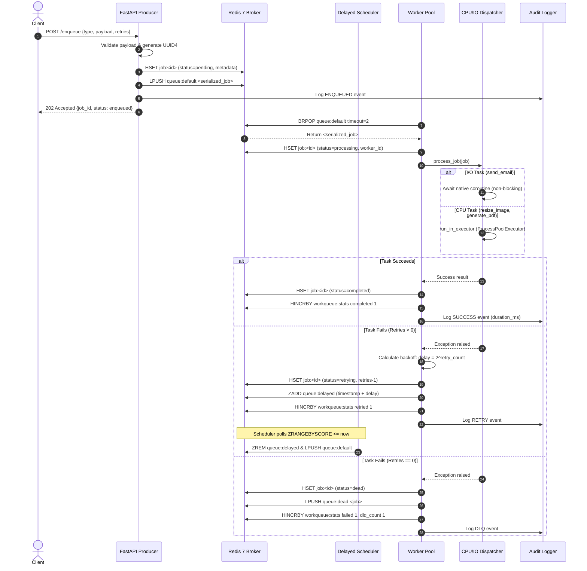

# WorkQueue: Complete System Design & Architecture Compendium

## Table of Contents
1. [Executive Summary & Problem Statement](#1-executive-summary--problem-statement)
2. [Architectural Goals & System Requirements](#2-architectural-goals--system-requirements)
3. [Technology Selection & Trade-Off Analysis](#3-technology-selection--trade-off-analysis)
4. [End-to-End System Architecture & Data Flow](#4-end-to-end-system-architecture--data-flow)
5. [Redis Data Structures & Schema Design](#5-redis-data-structures--schema-design)
6. [Component-by-Component Deep Dive](#6-component-by-component-deep-dive)
   - [6.1 Shared Schemas (`shared/schemas.py`)](#61-shared-schemas-sharedschemaspy)
   - [6.2 Redis Client & Atomic Metrics (`shared/redis_client.py`)](#62-redis-client--atomic-metrics-sharedredis_clientpy)
   - [6.3 Persistent Audit & File Logging (`shared/logger.py`)](#63-persistent-audit--file-logging-sharedloggerpy)
   - [6.4 Producer API (`producer/main.py`)](#64-producer-api-producermainpy)
   - [6.5 Hybrid Task Dispatcher & GIL Bypass (`worker/handlers.py`)](#65-hybrid-task-dispatcher--gil-bypass-workerhandlerspy)
   - [6.6 Worker Pool & Schedulers (`worker/main.py`)](#66-worker-pool--schedulers-workermainpy)
7. [Python WorkQueue vs Go WorkQueue: Exhaustive Comparison](#7-python-workqueue-vs-go-workqueue-exhaustive-comparison)
8. [Failure Modes, Edge Cases & Reliability Patterns](#8-failure-modes-edge-cases--reliability-patterns)
9. [Scaling & Production Deployment Strategy](#9-scaling--production-deployment-strategy)
10. [Master Interview Cheatsheet (16 High-Yield Q&As)](#10-master-interview-cheatsheet-16-high-yield-qas)

---

## 1. Executive Summary & Problem Statement

In web development and microservice architectures, user-facing HTTP request handlers must respond as quickly as possible (< 100ms). However, modern applications frequently trigger operations that take hundreds of milliseconds to several seconds:
- Sending transactional and marketing emails via SMTP or third-party APIs.
- Resizing, cropping, and optimizing uploaded media files.
- Compiling and rendering complex PDF invoices or analytical reports.
- Triggering external webhooks and third-party data synchronization.

If these tasks are executed synchronously within the web request cycle:
1. **HTTP Thread Starvation:** High-latency operations consume web worker threads, drastically reducing overall API throughput.
2. **Cascading Timeouts:** Client connections drop if processing exceeds reverse-proxy timeouts (e.g. Nginx 60s timeout).
3. **Catastrophic Failure Modes:** If an external email provider experiences downtime, the entire user registration or checkout flow fails synchronously.

**The Solution:** **WorkQueue** implements an asynchronous, distributed **Producer-Consumer architecture**. Incoming operations are validated, stamped with a unique UUID, serialized into an in-memory Redis message broker in under 5 milliseconds, and confirmed immediately with `HTTP 202 Accepted`. Decoupled background worker pools asynchronously consume, dispatch, execute, and retry tasks with fault tolerance and end-to-end observability.

---

## 2. Architectural Goals & System Requirements

### Functional Requirements
- **Task Ingestion (`POST /enqueue`):** Ingest arbitrary JSON payloads with task type specifications and retry configurations.
- **Task Execution:** Execute tasks according to computational characteristics (I/O-bound vs CPU-bound).
- **Lifecycle Tracking (`GET /jobs/{job_id}`):** Query O(1) job status (`pending`, `processing`, `completed`, `retrying`, `dead`) and timing metadata.
- **Fault Tolerance & Exponential Backoff:** Automatically retry failed tasks with delay progression ($2^{\text{attempt}}$ seconds) rather than immediate flooding.
- **Dead Letter Queue (`GET /dead-letter`):** Isolate permanently failing tasks (poison pills) upon retry exhaustion for engineering inspection.
- **Live System Metrics (`GET /metrics`):** Real-time monitoring of queue backlogs, active worker pools, and cumulative execution counts.
- **Audit Logging (`GET /audit-logs`):** Persistent, structured event trails recording execution latencies, worker assignments, and errors.

### Non-Functional Requirements
- **High Throughput / Low Ingestion Latency:** Producer ingestion latency must be $\le 5\text{ms}$ per request.
- **Zero Duplicate Deliveries during Normal Operation:** Atomic queue popping guarantees single-worker delivery.
- **Resilience to Transient Outages:** Exponential backoff ensures third-party API hiccups do not exhaust retries instantly.
- **Graceful Termination:** Workers intercept OS shutdown signals (`SIGINT`, `SIGTERM`) to finish active jobs before termination.
- **CPU Core Utilization:** Bypasses Python’s Global Interpreter Lock (GIL) for compute-intensive workloads.

---

## 3. Technology Selection & Trade-Off Analysis

| Layer | Chosen Technology | Alternatives Considered | Rationale & Trade-Offs |
| :--- | :--- | :--- | :--- |
| **API Framework** | **FastAPI + Uvicorn** | Flask, Django REST Framework, Go `net/http` | Native async support via ASGI, automatic OpenAPI documentation, high RPS, and Pydantic v2 integration. |
| **Data Validation** | **Pydantic v2** | Marshmallow, Cerberus, Go Structs | Built on a Rust core (`pydantic-core`), offering 5-10x faster serialization/validation than v1, native UUID generation, and strict typing. |
| **Queue / Broker** | **Redis 7** | RabbitMQ, Apache Kafka, AWS SQS | Ultra-low sub-millisecond latency, minimal operational complexity, native data structures (Lists, Hashes, Sorted Sets) perfectly suited for queues and delayed backoff. |
| **I/O Concurrency** | **Python `asyncio`** | Threading, Celery, Go Goroutines | Cooperative multitasking with negligible memory footprint (~30MB process), perfect for high-concurrency non-blocking network I/O. |
| **CPU Parallelism** | **`ProcessPoolExecutor`** | `ThreadPoolExecutor`, Celery prefork | Spawns separate OS processes with independent Python interpreters, completely bypassing CPython's GIL. |
| **Observability** | **Rotating File Handlers** | Ephemeral stdout only | Prevents disk exhaustion via automated log rotation while preserving historical audit trails across container restarts. |

---

## 4. End-to-End System Architecture & Data Flow

```
                                      +------------------------------------+
                                      |            Client / HTTP           |
                                      +-----------------+------------------+
                                                        |
                             +--------------------------+--------------------------+
                             |                                                     |
                       POST /enqueue                                          GET /metrics
                             |                                                     |
                             v                                                     v
                 +-----------------------+                             +-----------------------+
                 |   Producer (FastAPI)  |                             |   Producer (FastAPI)  |
                 | - UUID generation     |                             | - Live Queue Depths   |
                 | - Pydantic validation |                             | - Completed / Failed  |
                 | - Hash initialization |                             | - In-flight & Delayed |
                 +-----------+-----------+                             +-----------------------+
                             |
                     LPUSH queue:default
                             |
                             v
                 +-------------------------------------------------------------------------+
                 |                                REDIS 7                                  |
                 |  - queue:default    (FIFO in-memory queue via Lists)                    |
                 |  - queue:delayed    (Sorted Set for exponential backoff retries)        |
                 |  - queue:dead       (Dead Letter Queue for exhausted jobs)              |
                 |  - job:<id>         (Hash: status, payload, metadata, timings)          |
                 |  - workqueue:stats  (Atomic counters via HINCRBY)                       |
                 |  - workqueue:workers(Active worker heartbeats with TTLs)                |
                 +------------------------------------+------------------------------------+
                                                      |
                                          BRPOP / Delayed Scheduler
                                                      |
                                                      v
                 +-------------------------------------------------------------------------+
                 |                    Worker Service Pool (Asyncio)                        |
                 |                                                                         |
                 |   +-------------------+   +-------------------+   +-------------------+ |
                 |   |   worker-1 task   |   |   worker-2 task   |   |   worker-3 task   | |
                 |   +---------+---------+   +---------+---------+   +---------+---------+ |
                 |             |                       |                       |           |
                 |             +-----------------------+-----------------------+           |
                 |                                     |                                   |
                 |                       Task Dispatcher (CPU vs I/O)                      |
                 |                      /                            \                     |
                 |            [I/O Bound: async]              [CPU Bound: ProcessPool]     |
                 |            - send_email                    - resize_image               |
                 |            - webhooks                      - generate_pdf               |
                 |                                                                         |
                 |   - Persistent Audit Logger (`logs/audit.log` & `logs/worker.log`)      |
                 |   - Graceful Drain on SIGINT/SIGTERM                                    |
                 +-------------------------------------------------------------------------+
```

### Complete Job Lifecycle Sequence


---

## 5. Redis Data Structures & Schema Design

| Redis Key / Pattern | Redis Data Type | Purpose & Lifecycle | Time Complexity |
| :--- | :--- | :--- | :--- |
| **`queue:default`** | `List` | Ready FIFO task queue. Producer pushes via `LPUSH`; workers consume via `BRPOP`. | $O(1)$ per push/pop |
| **`queue:delayed`** | `Sorted Set (ZSET)` | Stores tasks undergoing exponential backoff. The score is the target Unix execution timestamp (`now + delay`). | $O(\log N)$ insert, $O(M)$ range query |
| **`queue:dead`** | `List` | Dead Letter Queue (DLQ) preserving poison pill tasks that exhausted all retry attempts. | $O(1)$ push |
| **`job:{job_id}`** | `Hash` | O(1) state registry storing job metadata, parameters, worker IDs, and execution timestamps. | $O(1)$ read/write |
| **`workqueue:stats`** | `Hash` | Centralized, atomic execution counters (`completed`, `failed`, `retried`, `dlq_count`) updated via `HINCRBY`. | $O(1)$ increment |
| **`workqueue:workers`** | `Set` | Cluster-wide registry of active worker IDs. | $O(1)$ add/remove |
| **`worker:heartbeat:{id}`** | `String` | Ephemeral heartbeat key with 15-second TTL. Automatically expires if a worker crashes. | $O(1)$ set with EX |

---

## 6. Component-by-Component Deep Dive

### 6.1 Shared Schemas (`shared/schemas.py`)
Defines strict data models utilizing **Pydantic v2**:
- **`Job` Model:** Represents a unit of work. Automatically populates `id` via `uuid4()`, records `created_at` timestamp, and initializes `retries` and `status`.
- **`QueueMetrics` Model:** Enforces typing on system monitoring responses returned by `GET /metrics`.

```python
class Job(BaseModel):
    id: str = Field(default_factory=lambda: str(uuid4()))
    type: str
    payload: Dict[str, Any] = Field(default_factory=dict)
    retries: int = Field(default=3, ge=0)
    max_retries: int = Field(default=3, ge=0)
    status: str = Field(default="pending")
    created_at: float = Field(default_factory=time.time)
    started_at: Optional[float] = None
    completed_at: Optional[float] = None
    worker_id: Optional[str] = None
    last_error: Optional[str] = None
    retry_count: int = Field(default=0, ge=0)
```

### 6.2 Redis Client & Atomic Metrics (`shared/redis_client.py`)
- **Connection Management:** Uses non-blocking `redis.asyncio.Redis` with `decode_responses=True`.
- **Atomic Operations:** Encapsulates `HINCRBY` via `incr_stat()` to guarantee thread-safe, cluster-wide metric tracking.
- **Pipelined Queries (`get_system_metrics`):** Batches `LLEN queue:default`, `ZCARD queue:delayed`, and `LLEN queue:dead` into a single round-trip TCP pipeline, drastically reducing network overhead.
- **Heartbeat Leasing Pattern:** Workers register ephemeral keys (`SET worker:heartbeat:{id} <ts> EX 15`). Stale workers whose processes were killed are dynamically detected and evicted.

### 6.3 Persistent Audit & File Logging (`shared/logger.py`)
- **Dual Console/File Logging:** Technical operational logs stream to `stdout` and a 5MB rotating file (`logs/worker.log`).
- **Structured Audit Trail (`AuditLogger`):** Appends business lifecycle events to `logs/audit.log` using standardized, grep-friendly key-value pairs (`JobID`, `Type`, `WorkerID`, `Duration`, `RetriesLeft`, `Payload`, `Error`).
- **Inspection Helper:** `get_recent_audit_logs(limit)` allows the HTTP API to read the tail of the audit file for instant browser inspection.

### 6.4 Producer API (`producer/main.py`)
Built on FastAPI to deliver sub-5ms ingestion latency:
- `POST /enqueue`: Validates task parameters, records metadata hash in Redis, pushes serialized JSON to `queue:default`, and logs an `ENQUEUED` audit event.
- `GET /metrics`: Returns live operational stats (`QueueMetrics`).
- `GET /jobs/{job_id}`: Retrieves full lifecycle status, execution timestamps, and error history.
- `GET /dead-letter`: Returns dead letter queue contents for inspection.
- `GET /audit-logs`: Returns recent structured audit log records.
- `GET /health`: Verifies Redis ping connectivity and uptime.

### 6.5 Hybrid Task Dispatcher & GIL Bypass (`worker/handlers.py`)
Solves Python's Global Interpreter Lock bottleneck:
- **I/O-Bound Execution:** `_execute_io_send_email()` runs natively on the `asyncio` event loop using non-blocking network primitives.
- **CPU-Bound Execution:** `_execute_cpu_resize_image()` and `_execute_cpu_generate_pdf()` perform heavy mathematical and rendering loops. These are offloaded to a persistent `ProcessPoolExecutor` via `loop.run_in_executor()`.
- **The Result:** The main event loop remains 100% responsive: heartbeats never lapse, health checks never timeout, and `BRPOP` never freezes while intensive image or PDF rendering takes place.

### 6.6 Worker Pool & Schedulers (`worker/main.py`)
- **Concurrent Worker Pool:** Spawns `CONCURRENCY` (default: 3) concurrent `single_worker_loop()` coroutines. Each worker is assigned a named identity (`worker-1`, `worker-2`, `worker-3`).
- **Atomic Queue Popping:** Workers invoke `brpop("queue:default", timeout=2)`. Redis guarantees that each task is popped atomically by exactly one worker.
- **Delayed Queue Scheduler:** A dedicated coroutine runs every 1 second, querying `queue:delayed` via `zrangebyscore(min=0, max=now)`. Due tasks are atomically removed via `ZREM` and pushed onto `queue:default` via `LPUSH`.
- **Exponential Backoff Math:** Delay is computed as:
  $$\text{Delay (seconds)} = 2^{\text{retry\_count}} \quad (\text{Attempt 1: } 2\text{s}, \text{ Attempt 2: } 4\text{s}, \text{ Attempt 3: } 8\text{s})$$
- **Dead Letter Queue Routing:** When `retries == 0`, tasks transition to `dead` and move to `queue:dead`.
- **Graceful Shutdown:** Intercepts `SIGINT` (Ctrl+C) and `SIGTERM` (Docker/K8s stop), setting `is_running = False`. Idle workers wake within 2 seconds, while active workers finish their current job before the process exits cleanly.

---

## 7. Python WorkQueue vs Go WorkQueue: Exhaustive Comparison

| Feature / Metric | Go Implementation (`AbhinavXJ/WorkQueue`) | Our Python WorkQueue | Engineering Impact & Interview Talking Point |
| :--- | :--- | :--- | :--- |
| **Worker Concurrency** | 3 Goroutines managed by Go runtime. | Configurable `asyncio` worker pool (`WORKER_CONCURRENCY=3`). | Both achieve concurrent task consumption. Python uses cooperative coroutines with negligible memory footprint (~30MB). |
| **Multicore CPU Utilization** | Native across OS threads (no GIL in Go). | Hybrid Dispatcher: `asyncio` for I/O + `ProcessPoolExecutor` for CPU. | **Critical Python Senior Question:** Explaining how `ProcessPoolExecutor` bypasses the CPython GIL proves deep systems knowledge. |
| **Metrics Concurrency** | Unsynchronized global ints (`jobs_done++`, `jobs_failed++`). **(Data Race Bug)** | Atomic Redis counters (`HINCRBY workqueue:stats`). | **Huge Interview Win:** Pointing out that Go had data races while Python used Redis atomic commands demonstrates architectural maturity. |
| **Failure Handling** | Calls `log.Fatal("Task failed...")`. **(Fatal Crash Bug)** | Retry decrement + **Dead Letter Queue (`queue:dead`)**. | In Go, a single poison pill permanently kills the daemon. In our Python project, poison pills are isolated in the DLQ while the service continues running. |
| **Retry Strategy** | Immediate re-queuing into Redis. | **Exponential Backoff** ($2^s$ seconds) via Redis Sorted Sets. | Immediate retries cause thundering herds and burn retries during transient outages. Exponential backoff is the production standard. |
| **Job Identity & Querying** | Anonymous JSON payloads (no ID). Cannot query status. | Unique UUID4 assigned per job + `GET /jobs/{id}`. | Enables clients to track background task progression (`pending` $\to$ `processing` $\to$ `completed`). |
| **Graceful Shutdown** | None. OS signals terminate the process abruptly. | `signal.signal(SIGINT/SIGTERM)` drains in-flight jobs. | Prevents corrupted tasks when rolling deployments occur in Kubernetes or Docker. |
| **Logging & Audit Trail** | Hardcoded `/WorkQueue/logs.txt` without size caps or rotation. | Rotating file handlers (`logs/worker.log`, `logs/audit.log`) + `GET /audit-logs`. | Prevents server disk exhaustion while providing a structured audit compliance trail. |
| **API Documentation** | None. | Auto-generated interactive Swagger UI at `/docs`. | Standard enterprise DX (Developer Experience). |
| **Automated Testing** | Zero tests. | 14 automated unit and integration tests (`pytest` + `fakeredis`). | 100% deterministic, hermetic verification executing in under 2 seconds. |

---

## 8. Failure Modes, Edge Cases & Reliability Patterns

### 1. What happens if a Worker crashes midway through executing a job?
- **Current Behavior (`BRPOP`):** `BRPOP` removes the job from Redis immediately upon pickup (At-most-once delivery boundary). If a worker process receives `SIGKILL` or loses power while executing `process_job`, the task is lost.
- **Enterprise Solution (The Reliable Queue Pattern):** Use Redis `RPOPLPUSH` (or `LMOVE` in Redis 6.2+) to atomically pop from `queue:default` and push into an in-flight processing list (`queue:processing:{worker_id}`).
  - When the task completes, the worker removes it from `queue:processing`.
  - A separate supervisor/sweeper process inspects worker heartbeats. If a worker's heartbeat lapses, any tasks remaining in its `queue:processing` list are reclaimed and re-queued.

### 2. Poison Pill Payloads
- **Scenario:** A corrupted payload (e.g. malformed email syntax or unsupported format) causes unhandled exceptions.
- **Mitigation:** Retries are strictly capped (default: 3). Each failure decrements retries. Upon exhaustion, the task is shunted to `queue:dead` (Dead Letter Queue), isolating the poison pill and preventing queue starvation.

### 3. Thundering Herd Problem
- **Scenario:** An external service (e.g. email SMTP gateway) experiences a 10-second outage. If 500 tasks fail and retry instantly, they repeatedly pound the recovering gateway, prolonging the outage.
- **Mitigation:** Exponential backoff spaces out retries ($2\text{s} \to 4\text{s} \to 8\text{s}$). Optionally, adding **jitter** ($\pm \text{random}(0.1, 0.5)\text{s}$) completely desynchronizes retry attempts.

### 4. Redis Broker Outage
- **Scenario:** The Redis server crashes or restarts.
- **Mitigation:**
  - **FastAPI Producer:** Returns HTTP 500 with clear diagnostics if Redis is unreachable; health checks fail.
  - **Worker Pool:** Catches Redis connection errors, sleeps for 1 second, and attempts reconnection with exponential backoff rather than crashing.
  - **Redis Persistence:** Configure Redis with **AOF (Append Only File)** (`appendfsync everysec`) and **RDB snapshots** to ensure tasks in `queue:default` and `queue:delayed` survive broker restarts.

---

## 9. Scaling & Production Deployment Strategy

```
                                      +--------------------+
                                      |   Load Balancer    |
                                      |     (Nginx/ALB)    |
                                      +---------+----------+
                                                |
                         +----------------------+----------------------+
                         |                                             |
                         v                                             v
              [ Producer Container 1 ]                      [ Producer Container 2 ]
              (FastAPI - 4 Uvicorn Workers)                 (FastAPI - 4 Uvicorn Workers)
                         |                                             |
                         +----------------------+----------------------+
                                                |
                                                v
                                  +---------------------------+
                                  |   Redis Cluster / Sentinel|
                                  |   (Master + Replicas)     |
                                  +-------------+-------------+
                                                |
                   +----------------------------+----------------------------+
                   |                                                         |
                   v                                                         v
        [ Worker Container 1 ]                                    [ Worker Container 2 ]
        - 4 Async Worker Tasks                                    - 4 Async Worker Tasks
        - ProcessPoolExecutor (2 CPUs)                            - ProcessPoolExecutor (2 CPUs)
        - Delayed Scheduler                                       - Delayed Scheduler
```

### Scaling Dimensions
1. **Vertical Scaling (Concurrency Tuning):** Adjust `WORKER_CONCURRENCY` based on available CPU and RAM. For I/O tasks, 10-20 async worker tasks can comfortably run per container.
2. **Horizontal Scaling (Container Replicas):** Scale worker containers via Docker Compose or Kubernetes:
   ```bash
   docker compose up --build --scale worker=4
   ```
   Because Redis `BRPOP` is atomic, 4 worker containers running 3 workers each (12 total workers) consume from `queue:default` without race conditions or duplicated jobs.
3. **High Availability Broker:** Deploy Redis in a **Sentinel** or **Redis Cluster** configuration with automated failover and persistent volumes.

---

## 10. Master Interview Cheatsheet (16 High-Yield Q&As)

### Category A: System Design & Architecture

#### Q1: Why build a background job processing system instead of executing tasks synchronously inside the web request?
> **Answer:** "Executing high-latency tasks—such as sending emails, resizing images, or compiling PDFs—directly inside an HTTP handler ties up server worker threads. Under traffic surges, request queues back up, latency degrades from milliseconds to seconds, and client connections timeout. By decoupling ingestion (Producer) from processing (Worker) via Redis, our API responds in under 5ms with `202 Accepted`, delivering superior user experience and predictable API throughput."

#### Q2: Why choose Redis instead of RabbitMQ or Apache Kafka for this architecture?
> **Answer:** "Redis provides sub-millisecond in-memory data structures (`LPUSH`/`BRPOP`, Sorted Sets, Hashes) with minimal operational complexity. RabbitMQ would be preferred if we required complex AMQP routing topologies (exchange bindings, topic wildcards). Kafka would be preferred for high-throughput append-only event streaming with log retention and replayability. For a lightweight, ultra-low latency background task queue with delayed scheduling, Redis is optimal."

#### Q3: How do `LPUSH` and `BRPOP` achieve strict First-In, First-Out (FIFO) semantics?
> **Answer:** "Producer services push incoming tasks onto the head (left side) of the Redis list using `LPUSH`. Worker services block-pop tasks from the tail (right side) of the list using `BRPOP`. Inserting at the left and popping from the right guarantees strict FIFO order. Furthermore, `BRPOP` blocks at the socket level without consuming CPU cycles when the queue is empty."

---

### Category B: Concurrency, Python Internals & GIL Bypass

#### Q4: How does Python `asyncio` achieve concurrency on a single thread?
> **Answer:** "`asyncio` uses cooperative multitasking managed by an event loop. Coroutines yield control back to the event loop whenever they hit an `await` expression (such as network socket I/O with Redis or an SMTP server). While one coroutine waits for network data, the event loop executes other ready coroutines on the same thread. This achieves high I/O concurrency with minimal memory overhead (~30MB per process)."

#### Q5: What is the Python GIL, and how does your project bypass it for CPU-heavy tasks?
> **Answer:** "The Global Interpreter Lock (GIL) in CPython ensures that only one native thread executes Python bytecode at any instant. If a worker performs heavy CPU computation (image resampling or PDF rendering) directly on the event loop, the entire process freezes: heartbeats lapse, health checks fail, and new tasks cannot be popped.
>
> We solved this by implementing a **Hybrid Task Dispatcher**: I/O tasks (`send_email`) run natively on `asyncio`, while CPU tasks (`resize_image`, `generate_pdf`) are offloaded to a `ProcessPoolExecutor` via `loop.run_in_executor()`. Child processes run on separate CPU cores with independent Python interpreters and independent GILs, achieving true multi-core hardware parallelism."

#### Q6: Why use `ProcessPoolExecutor` instead of `ThreadPoolExecutor` for CPU-bound tasks?
> **Answer:** "In standard CPython, native threads share the same memory space and the same GIL. Running CPU computation on 8 threads across an 8-core CPU still only executes on one core at any given millisecond. `ProcessPoolExecutor` creates separate operating system processes, completely bypassing the GIL and unlocking 100% of multi-core CPU capacity."

---

### Category C: Go vs Python Comparative Analysis

#### Q7: How does your Python WorkQueue compare to Go-based implementations like `AbhinavXJ/WorkQueue`?
> **Answer:** "I studied Abhinav's Go implementation and identified several critical distributed systems vulnerabilities that we resolved in our Python architecture:
> 1. **Data Race on Metrics:** Go accessed global counters (`jobs_done++`) across goroutines without mutexes. We used atomic Redis `HINCRBY` commands.
> 2. **Process Crash Bug:** In Go, retry exhaustion triggered `log.Fatal()`, crashing the entire daemon. We implemented an enterprise Dead Letter Queue (`queue:dead`).
> 3. **Thundering Herd Retries:** Go re-queued failed tasks immediately. We engineered exponential backoff using Redis Sorted Sets.
> 4. **Job Tracking:** Go used anonymous payloads; we implemented UUID4 tracking with `GET /jobs/{id}`."

#### Q8: What is the concurrency model difference between Go Goroutines and Python Asyncio Tasks?
> **Answer:** "Goroutines are preemptively/cooperatively scheduled M:N green threads managed by the Go runtime across multiple OS threads, natively achieving parallelism without a GIL. Python `asyncio` is 1:N cooperative multitasking on a single thread. While Go has native multicore threading, Python `asyncio` combined with a `ProcessPoolExecutor` gives comparable performance with superior dynamic typing, schema validation (Pydantic v2), and API ecosystem integration (FastAPI)."

---

### Category D: Fault Tolerance, Queuing Semantics & Observability

#### Q9: What is Exponential Backoff and why is it superior to immediate retries?
> **Answer:** "Immediate retries suffer from the 'thundering herd' problem. If a downstream service has a 5-second network hiccup, retrying 3 times in 2 milliseconds exhausts all attempts and fails immediately. Exponential backoff delays retries by $2^{\text{retry\_count}}$ seconds (2s, 4s, 8s). This gives downstream dependencies time to recover and smooths out traffic spikes."

#### Q10: How do Redis Sorted Sets implement delayed task queues?
> **Answer:** "A Redis Sorted Set (`ZSET`) orders members by a numerical floating-point score. When a task needs to retry with a delay of $D$ seconds, we insert it into `queue:delayed` with score = $\text{now} + D$. A lightweight scheduler queries `ZRANGEBYSCORE queue:delayed 0 now`, removes due items via `ZREM`, and pushes them onto `queue:default` via `LPUSH`. This guarantees persistence and frees worker threads from blocking."

#### Q11: What is a Dead Letter Queue (DLQ) and what problem does it solve?
> **Answer:** "A Dead Letter Queue isolates 'poison pill' messages—tasks with corrupted payloads or unrecoverable software bugs that fail consistently. Without a DLQ, poison pills cycle through retry loops forever, wasting CPU cycles and potentially crashing workers. Capping retries and shunting to `queue:dead` isolates the bad task, preserves it for engineer inspection via `GET /dead-letter`, and allows the system to continue processing healthy jobs."

#### Q12: What are the three distributed delivery semantics, and which one does WorkQueue provide?
> **Answer:**
> - **At-most-once:** Task is popped immediately; if the worker dies during execution, the task is lost.
> - **At-least-once:** Task remains in an in-flight list (`queue:processing`) until completion is acknowledged. Requires idempotent task handlers.
> - **Exactly-once:** End-to-end deduplication using idempotent transaction keys.
>
> "Our current implementation uses `BRPOP` which operates at *at-most-once* boundary. For mission-critical workloads, we upgrade to *at-least-once* using Redis `LMOVE` / `RPOPLPUSH` into an in-flight list with a supervisor recovery sweeper."

#### Q13: How do you prevent race conditions when tracking system metrics across multiple workers?
> **Answer:** "In a distributed environment where multiple worker containers run across different machines, local memory counters cannot be aggregated and create data races. We offload metric counting to Redis's atomic `HINCRBY` command on the hash `workqueue:stats`. Because Redis executes operations sequentially on its single-threaded event loop, all increments are 100% atomic."

#### Q14: How does worker liveness tracking work without a consensus cluster (like Raft or ZooKeeper)?
> **Answer:** "We use the **Lease / Heartbeat Pattern** with Redis keys and TTLs. Every 5 seconds, active workers refresh `worker:heartbeat:{worker_id}` with a 15-second TTL. If a worker container crashes or is terminated by the OOM killer, its heartbeat key naturally expires. The monitoring routine checks key existence to calculate the true active worker count without complex distributed consensus."

#### Q15: How do you ensure graceful termination when scaling down containers in Kubernetes or Docker?
> **Answer:** "We register signal handlers for POSIX `SIGINT` and `SIGTERM`. When a shutdown signal is intercepted, we set an `is_running` flag to `False`. Idle workers waiting on `BRPOP` wake up after their 2-second timeout and exit cleanly. Any worker actively processing a task is permitted to finish execution, record its `completed` status to Redis, and flush audit logs before `asyncio.gather` cleanly exits the process."

#### Q16: How do you protect the filesystem from log disk exhaustion?
> **Answer:** "Standard appending (`open(file, 'a')`) will eventually consume all disk space and crash the host server. We use Python's `RotatingFileHandler`, which enforces strict size ceilings (e.g. 5MB for operational logs, 10MB for audit logs) and retains a fixed number of rolling backups (e.g. 3 to 5). When the ceiling is reached, the oldest archive is rotated and purged automatically."
